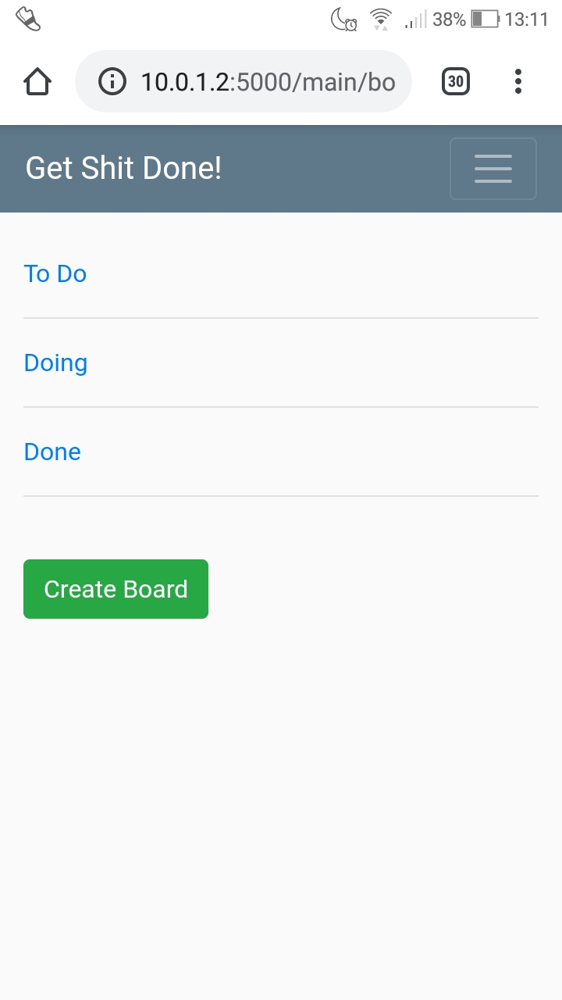

# Get Shit Done

Author: Valentin Neagu

Description: This app will help you get shit done. You still have to prioritise and execute, though...
Built for Android.

You can create multiple boards each containing any number of notes or TODOs. The notes can be edited, moved to another board and deleted. You can also add images to the notes.

Future versions will have these features: 
  - user groups
  - copy and archive notes
  - tags
  - board sharing
  - deadline calendar
  - audio notes
  - recurring TODOs (for things you have to do each week/day)

Using:
  - python: flask, sqlalchemy, wtforms
  - bootstrap
  - javascript
  - sqlite

## Usage
cd into the project folder and execute 'python run.py'

## License: BSD 3-Clause

## screenshots

